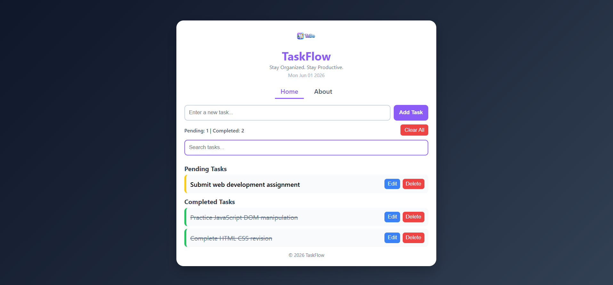
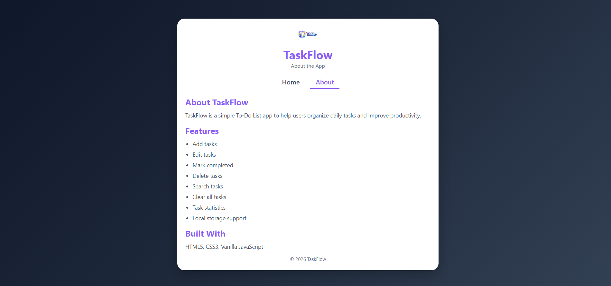
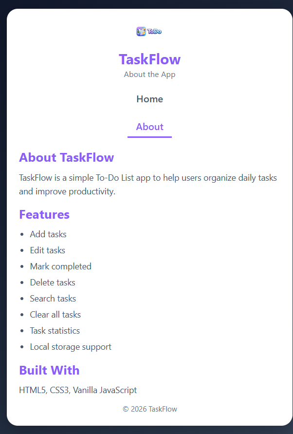

# 📝 Web Development Internship - Task 2

## 📌 Project Title

TaskFlow - To-Do List Web Application

---

## 🎯 Objective

Build a dynamic To-Do List web application using HTML, CSS, and Vanilla JavaScript where users can add, edit, delete, search, and manage tasks efficiently.

---

## 🛠️ Technologies Used

* HTML5
* CSS3
* JavaScript (ES6)
* Local Storage
* Flexbox
* Media Queries

---

## ✨ Features

* Add new tasks
* Edit existing tasks
* Delete tasks
* Mark tasks as completed
* Move completed tasks back to pending
* Search tasks instantly
* Clear all tasks
* Task statistics (Pending & Completed count)
* Local Storage support
* Current date display
* Responsive design for mobile and desktop
* Separate About page

---

## 📁 Project Structure

```text
ELEVATE_LABS_INTERNSHIP/
└── Task2
    ├── index.html
    ├── about.html
    ├── style.css
    ├── script.js
    ├── logo.png
    ├── homepage_desktop.png
    ├── homepage_mobile.png
    ├── aboutpage_desktop.png
    ├── aboutpage_mobile.png
    └── README.md
```

---

## 🔗 Navigation Pages

### Home Page

Contains the complete To-Do List application where users can manage their tasks.

### About Page

Provides information about the project, its features, and technologies used.

---

## 📱 Responsive Design

This project is fully responsive and adapts to different screen sizes using CSS Media Queries.

### Desktop View

* Full-width layout
* Horizontal navigation menu
* Spacious task management interface
* Optimized desktop experience

### Mobile View

* Responsive layout
* Stacked navigation menu
* Mobile-friendly controls
* Optimized spacing and typography

Media Query Used:

```css
@media (max-width: 600px)
```

---

## 📸 Screenshots

### Home Page - Desktop



### Home Page - Mobile


### About Page - Desktop



### About Page - Mobile



---

## 🚀 How to Run the Project

1. Download or clone the repository.
2. Open the project folder in VS Code.
3. Open `index.html`.
4. Run using the Live Server extension.

OR

Open `index.html` directly in any web browser.

---

## 💡 Key Concepts Used

* DOM Manipulation
* Event Listeners
* JavaScript Functions
* Local Storage
* Dynamic UI Updates
* CSS Flexbox
* Responsive Web Design

---

## 👩‍💻 Author

**Budati Nimisha Sri Sai**

Web Development Internship - Task 2

---

## 📌 Note

This project was created as part of a Web Development Internship assignment. It demonstrates practical implementation of HTML5, CSS3, JavaScript DOM manipulation, event handling, local storage, and responsive web design principles through a fully functional To-Do List application.
