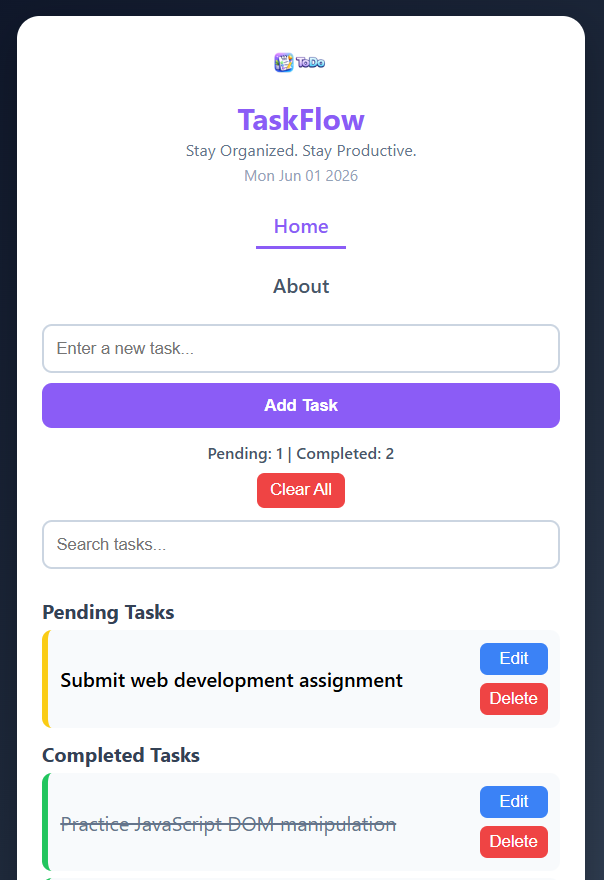
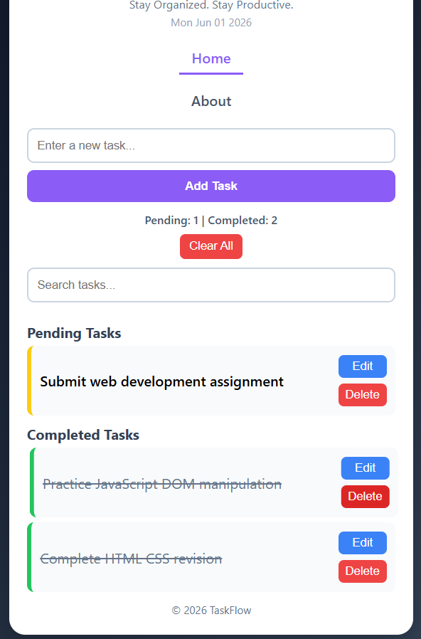

# 📝 Web Development Internship - Task 2

## 📌 Project Title

**TaskFlow - To-Do List Web Application**

---

## 🎯 Objective

Create a dynamic To-Do List web application using HTML, CSS, and Vanilla JavaScript where users can efficiently manage daily tasks by adding, editing, deleting, searching, and marking tasks as completed.

---

## 🛠️ Technologies Used

* HTML5
* CSS3
* JavaScript (ES6)
* Local Storage
* Flexbox
* Media Queries

---

## ✨ Features

* Add new tasks
* Edit existing tasks
* Delete tasks
* Mark tasks as completed
* Move completed tasks back to pending
* Search tasks instantly
* Clear all tasks
* Task statistics (Pending & Completed count)
* Local Storage support
* Current date display
* Responsive design for desktop and mobile devices
* Separate About page

---

## 📁 Project Structure

```text
Task2/
├── about.html
├── aboutpage_desktop.png
├── aboutpage_mobile.png
├── homepage_desktop.png
├── homepage_mobile_0.png
├── homepage_mobile_1.png
├── index.html
├── logo.png
├── README.md
├── script.js
└── style.css
```

---

## 🔗 Navigation Pages

### 🏠 Home Page

The Home page contains the complete To-Do List application where users can:

* Add tasks
* Edit tasks
* Delete tasks
* Search tasks
* Mark tasks as completed
* View task statistics

### ℹ️ About Page

The About page provides information about the project, its features, and technologies used.

---

## 📱 Responsive Design

This project is fully responsive and adapts to different screen sizes using CSS Media Queries.

### Desktop View

* Horizontal navigation menu
* Spacious layout
* Optimized user experience
* Task management interface with clear visibility

### Mobile View

* Navigation links stack vertically
* Responsive input fields and buttons
* Optimized spacing and typography
* Mobile-friendly task management

Media Query Used:

```css
@media (max-width: 600px)
```

---

## 📸 Screenshots

### Home Page - Desktop


### Home Page - Mobile (Part 1)



### Home Page - Mobile (Part 2)



### About Page - Desktop


### About Page - Mobile


---

## 💡 Key Concepts Used

* DOM Manipulation
* Event Handling
* JavaScript Functions
* Local Storage
* Dynamic UI Updates
* CSS Flexbox
* Responsive Web Design

---

## 🚀 How to Run the Project

1. Download or clone the repository.
2. Open the project folder in VS Code.
3. Open `index.html`.
4. Run using the Live Server extension.

### OR

Open `index.html` directly in any modern web browser.

---

## 👩‍💻 Author

**Budati Nimisha Sri Sai**

Web Development Internship - Task 2

---

## 📌 Note

This project was developed as part of a Web Development Internship assignment. It demonstrates practical implementation of HTML5, CSS3, JavaScript DOM manipulation, event handling, local storage, and responsive web design principles through a fully functional To-Do List application.
